# Laboratorium nr 1 - "Praca z systemem kontroli wersji, podstawy WWW"
## Wykonałem prostą stronę WWW składającą się z czterech podstron. Wykorzystując HTML, CSS oraz JS.
1. index.html
* Przy tworzeniu strony korzystałem z szablonu "Bare". W którym podmieniłem tytuł na moje imie i nazwisko, dodałem hiperłącza,do kolejnych podstron, przypisane do przycisków w menu strony.

* Strona startowa zawiera jedynie imie oraz nazwisko autora oraz logo Akademii Marynarki Wojennej w Gdyni.
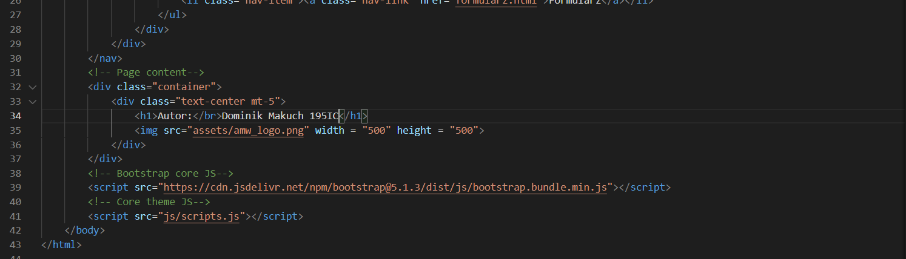
2. list.html
* Podstrona list.html zawiera tekst sformatowany w taki sposób aby przypominał list. Jako tło kontenera "
" o klasie "list" ustawiłem zdjęcie kartki papieru. 
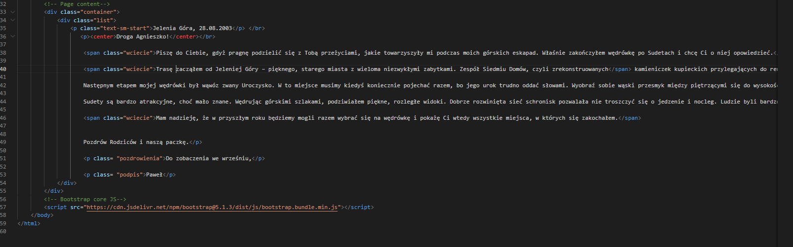
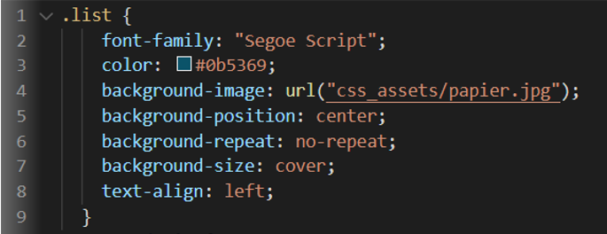
3. strona.html
* Podstrona strona.html przedstawia stronę z podręcznika do matematyki zawierającą 3 zadania z podpunktami do rozwiązania.
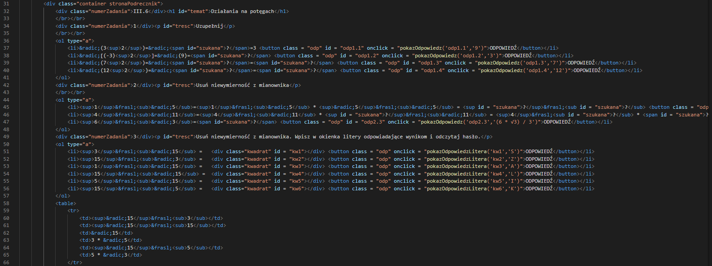
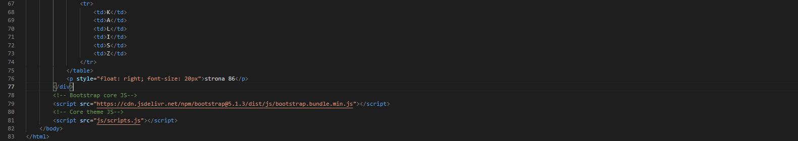
* Przy każdym zadaniu umieściłem przyciski, które po naciśnięciu wywołują funkcję JavaScript tworzącą nowe obiekty "
" zawierające poprawne odpowiedzi dla każdego przykładu.
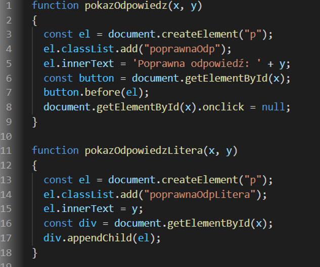
4. formularz.html
* Podstrona formularz.html zawiera prosty formularz wykorzystujący; inputy, pola tesktowe, radiobutton. 
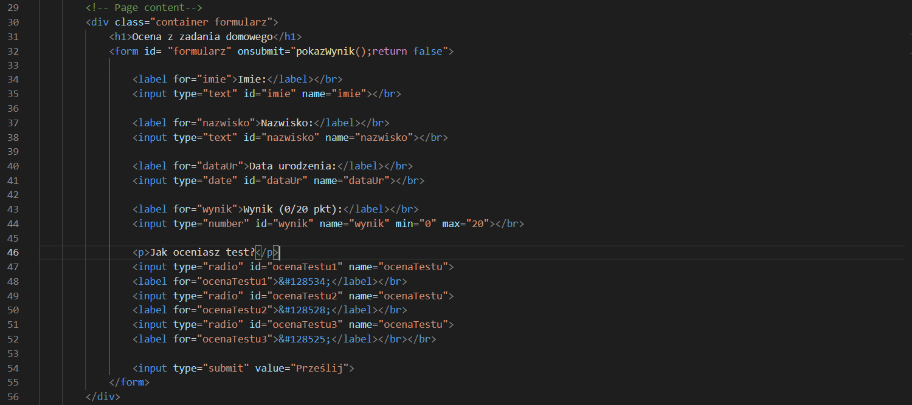
* Po uzupełnieniu formularza i zatwierdzeniu za pomocą przycisku submit, podane powyżej informacje zostają wypisane za formularzem wraz z wyliczonym procentowym wynikiem z "testu".
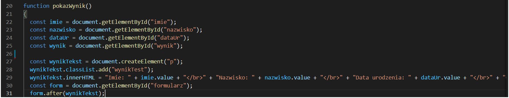
## Zrzuty ekranu zrealizowanych stron
* index.html
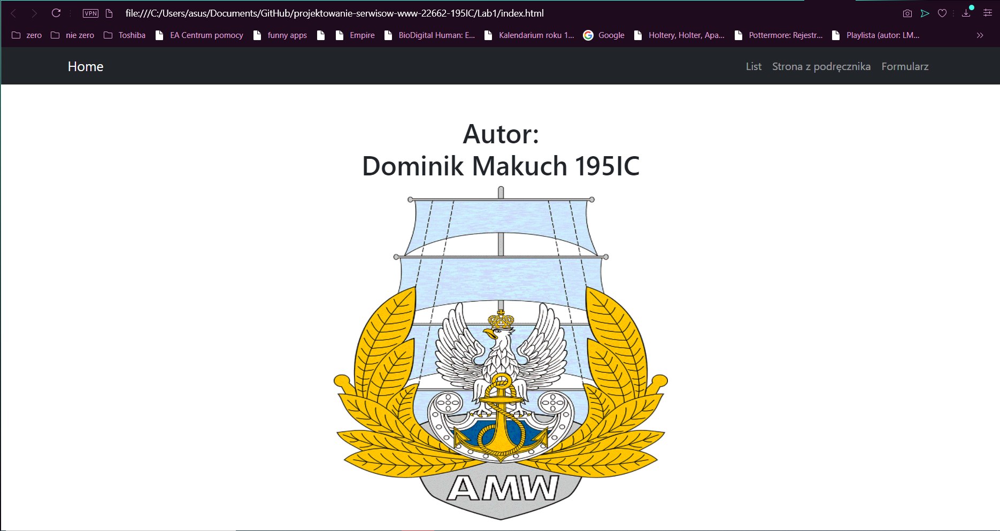
* list.html
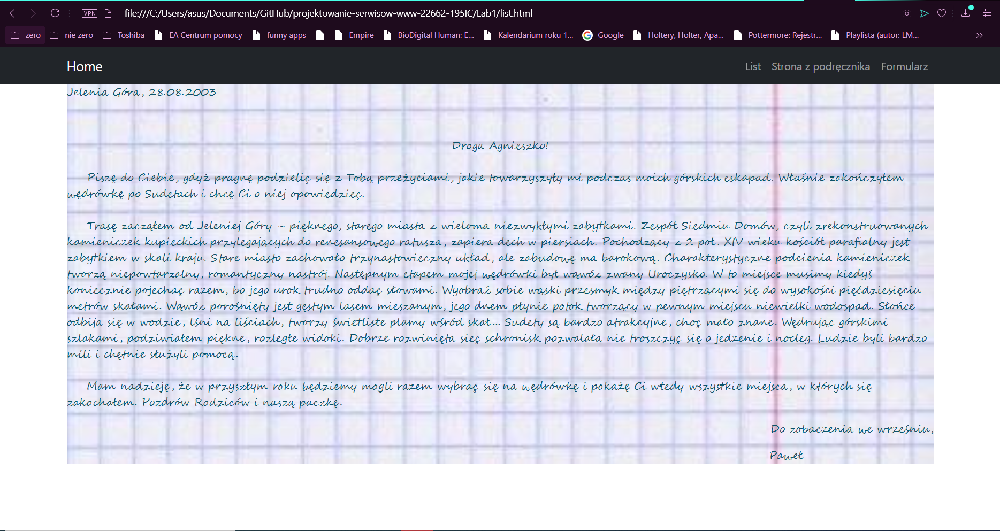
* strona.html
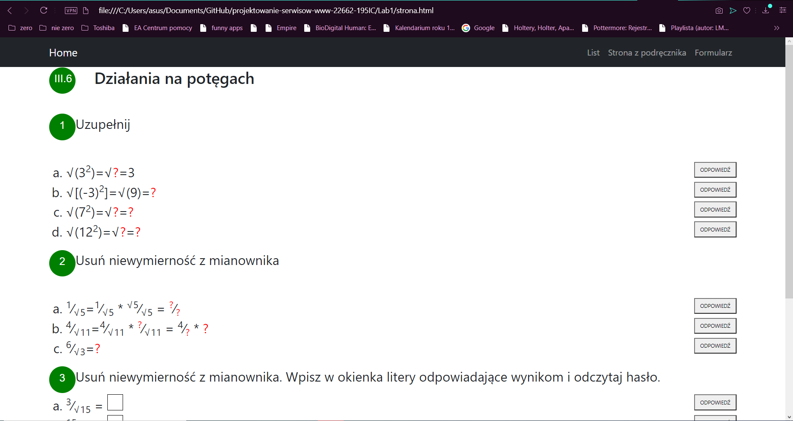
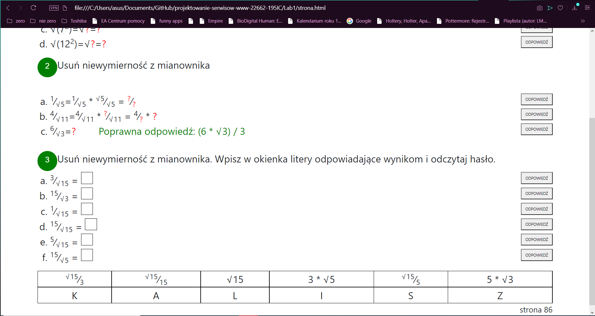
* formularz.html
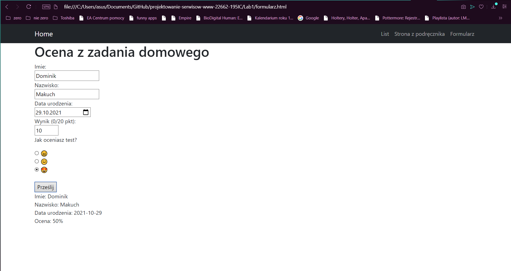