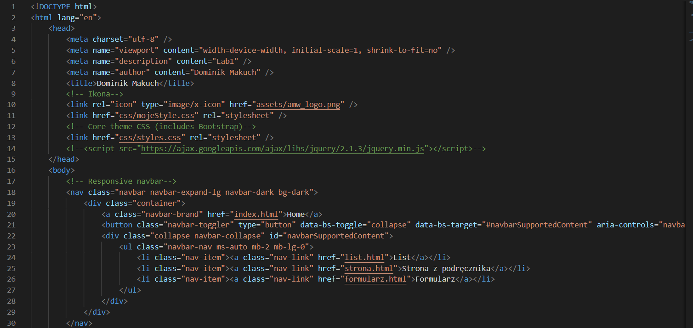

# Laboratorium nr 1 - "Praca z systemem kontroli wersji, podstawy WWW"

1. index.html
* Przy tworzeniu strony korzystałem z szablonu "Bare". W którym podmieniłem tytuł na moje imie i nazwisko, dodałem hiperłącza,do kolejnych podstron, przypisane do przycisków w menu strony.

