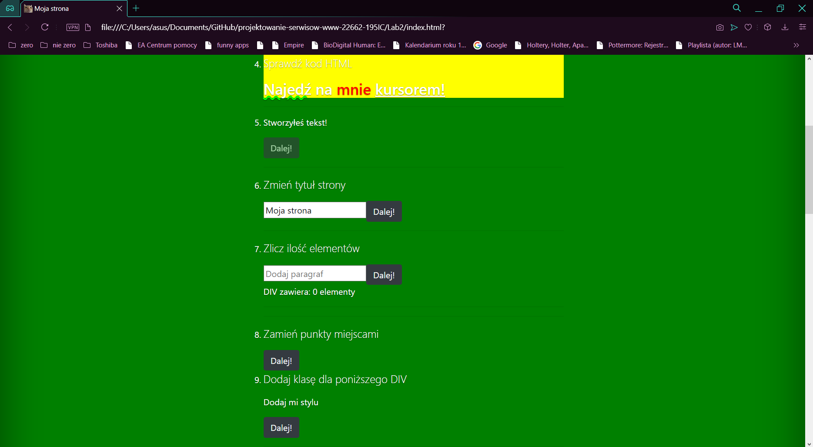

# Laboratorium nr 2 - "Praca z elementami DOM z wykorzystaniem Javascript"
## Wykonałem prostą stronę WWW składającą się z 20 przykładów wykorzystania JavaScript do pracy z elementami DOM.
1. Punkt nazwany "captcha" losowo generuje zapytanie o wybór zdjęcia a następnie sprawdza poprawność wyboru.

2. Punkt zmienia wartości wszystkich przycisków na stronie na wartość podaną przez użytkownika.
3. Punkt zmienia kolor tła strony poprzez wciśnięcie przycisku na kawiaturze.
4. Punkt po najechaniu na tekst wyświetla kod HTML tego tekstu.
5. Punkt po naciśnięciu na przycisk tworzy nowy napis.
6. Punkt zmienia tytuł strony na podany przez użytkownika.

7. Punkt pozwala na dodawanie kolejnych paragrafów do istniejącego DIV'a jednocześnie zliczając ilość dodanych paragrafów.
8. Punkt po naciśnięciu na przycisk następuje przypisanie klasy do DIV'a a w efekcie zmiana jego stylu.
9. Punkt pozwala na zamianę miejscami punktu 8 oraz 9.
10. Punkt po naciśnięciu na przycisk DIV z punktu 8 traci przypisaną mu wcześniej klasę.

11. Punkt pozwala na usunięcie dowolnego elementu z listy zawierającej wszystkie punkty.

12. Punkt zmienia kolor tła punktu zawierającego element o id="pom" automatycznie przechodząc do miejsca na stronie w którym się znajduje.

13. Punkt pozwala na edycję dowolnego paragrafu na stronie.
14. Punkt zmienia pierwszy element listy na wartość podaną przez użytkownika.
15. Punkt zmienia kursor na "crosshair".
16. Punkt zmienia "favicon".

17. Punkt po kliknięciu na zdjęcie psa zmienia się ono naprzemiennie.

18. Punkt zdjęcie psa z punktu poprzedniego zmienia się w zależności od wartości wybranej przez użytkownika za pomocą suwaka.
19. Punkt tekst na stronie zmienia kolor na kolor wybrany przez użytkownika.

20. Punkt usuwa zawartość sekcji 'body' i dodaje nagłówek z moim imieniem oraz nazwiskiem.
