# Laboratorium nr 4 - "Gra przeglądarkowa"
## Wykonałem grę przeglądarkową będącą prostą platformówką, której celem jest zebranie wszystkich monet na planszy unikając przy tym kolcy które odejmują życie.
## Gracz na start otrzymuje 3 życia, po straceniu wszystkich wyświetlany jest ekran przegranej. Po zebraniu wszystkich monet wyświetlany jest ekran zwycięstwa.

1. index.html
* Po uruchomieniu strony pojawia się 'Menu' gry z 3 możliwymi poziomami do wyboru.

* Menu zawarte jest w "div" którego ".display" zmieniany jest na "none" po wybraniu poziomu.
* Każdy "button" ma przypisaną akcję "onclick" która wywołuje funkcję "startGame()" z odpowiednim argumentem.

2. Level1
* Po wybraniu pierwszego poziomu pojawia się plansza poziomu nr 1.
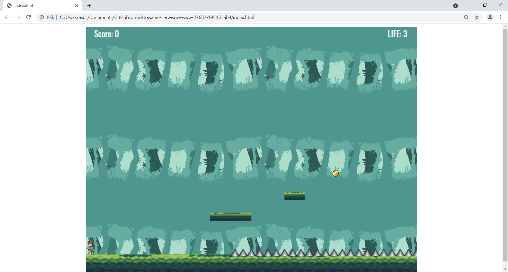
* Zebranie wszysktich monet.
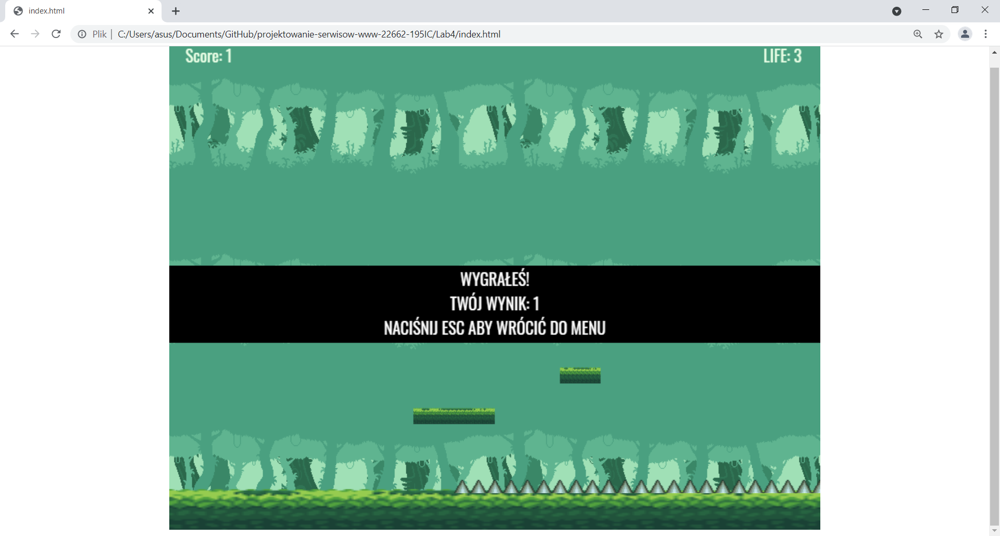
* Stracenie wszystkich żyć.
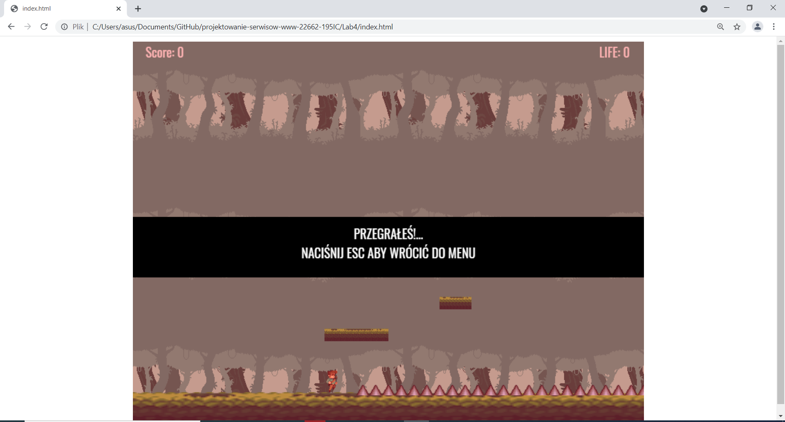
3. Level2
* Po wybraniu drugiego poziomu pojawia się plansza poziomu nr 2.
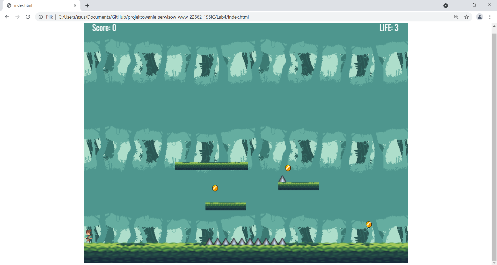
* Zebranie wszystkich monet.
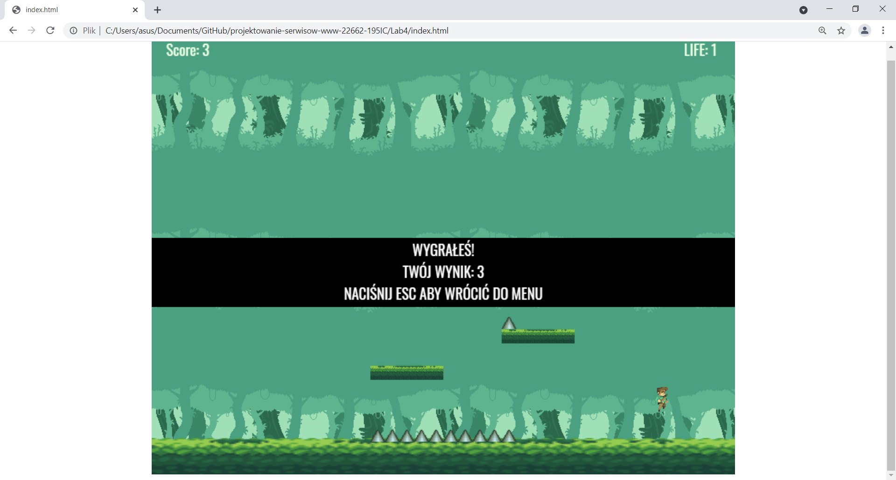
* Stracenie wszystkich żyć.
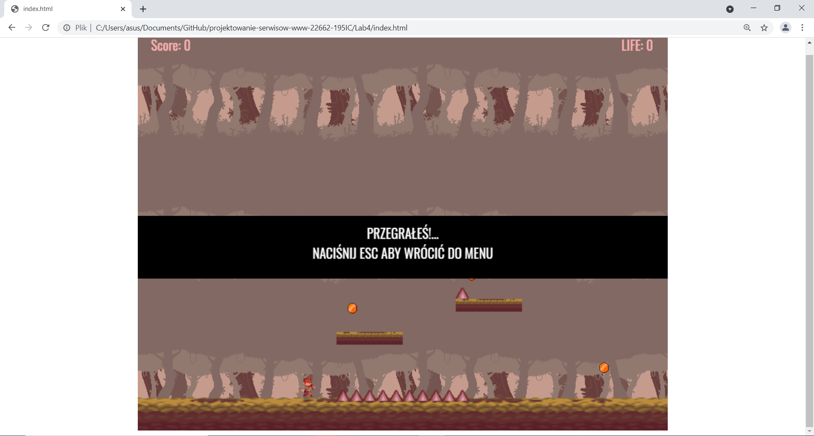
4. Level3
* Po wybraniu trzeciego poziomu pojawia się plansza poziomu nr 3.
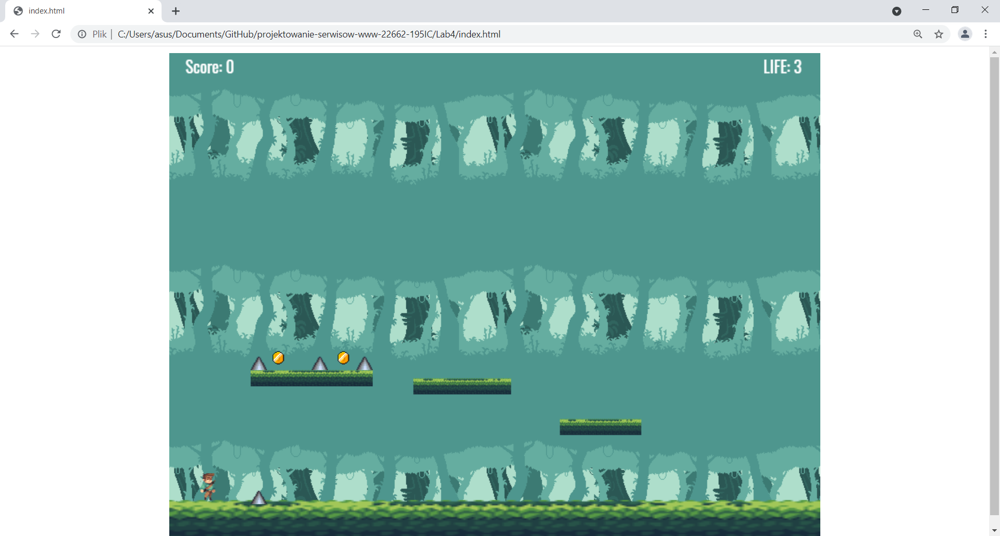
* Zebranie wszystkich monet.
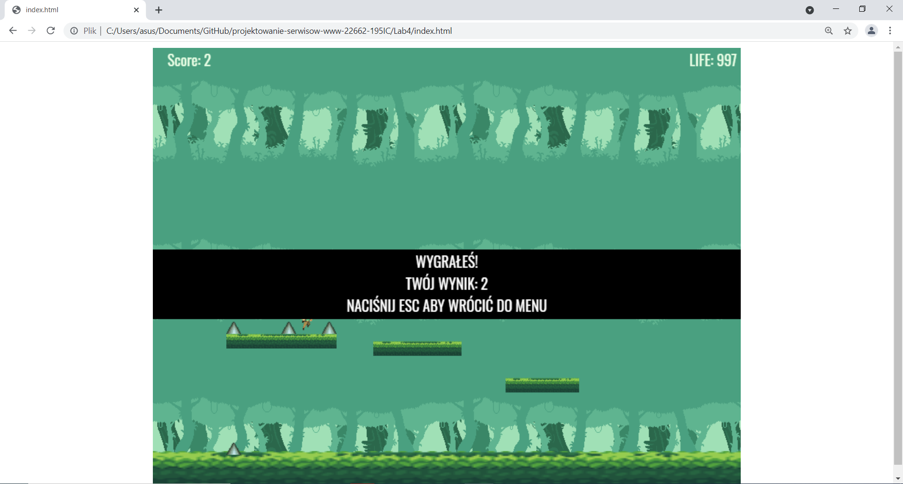
* Stracenie wszystkich żyć.
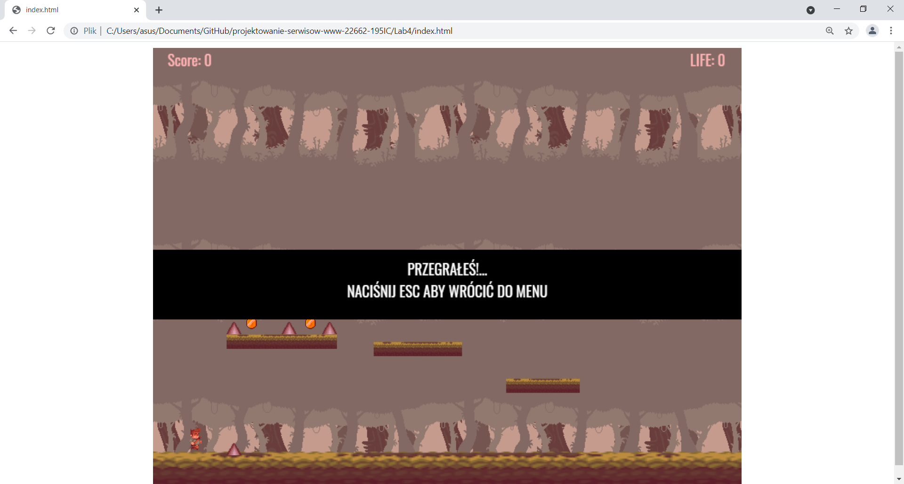
5. Funkcja startGame().
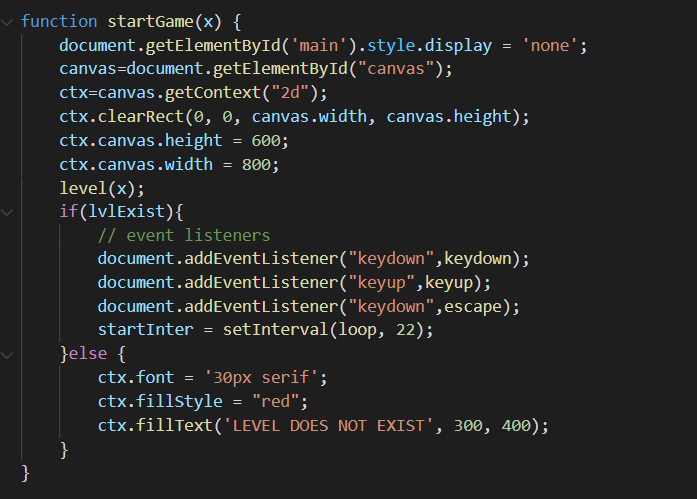
* Funkcja startGame(x) odpowiada za inicjalizację gry.
* Najpierw wartość ".style.display" div'a zawierającego 'menu' zostaje zmienione na "none" w celu "schowania" menu na czas rozgrywki.
* Następnie tworzony jest 'canvas' o wymiarach 600 na 800px.
* Po czym wywoływana jest funkcja level(x) która "rysuje" elementy na planszy w zależności od wybranego poziomu.
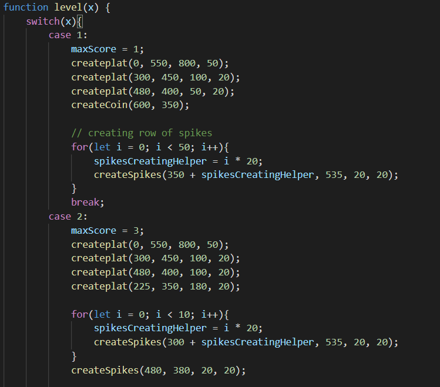
* Funkcja createplat(x, y, wys, szer) tworzy nowe elementy listy platforms[], będące platformami po których porusza się gracz, które następnie są renderowane z podanymi atrybutami na planszy.
* Funckja createCoin(x, y) tworzy nowe elementy listy coins[], będące monetami które zbiera gracz, które następnie są renderowane na planszy z podanymi atrybutami.
* Funckja createSpikes(x, y, wys, szer) tworzy nowe elementy listy spikes[], będące kolcami które odejmują życie gracza, które następenie renderowane są na planszy z podanymi atrybutami.

* Następnie jeśli istnieje podany poziom rozpoczyna się nasłuchiwanie wciskania przycisków przez użytkownika oraz rozpoczęcie głównej pętli gry.
* Jeśli podany poziom nie istnieje wyświetlana jest informacja o tym, że nie ma takiego poziomu.
6. Funkcja loop().
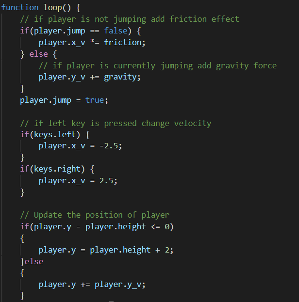
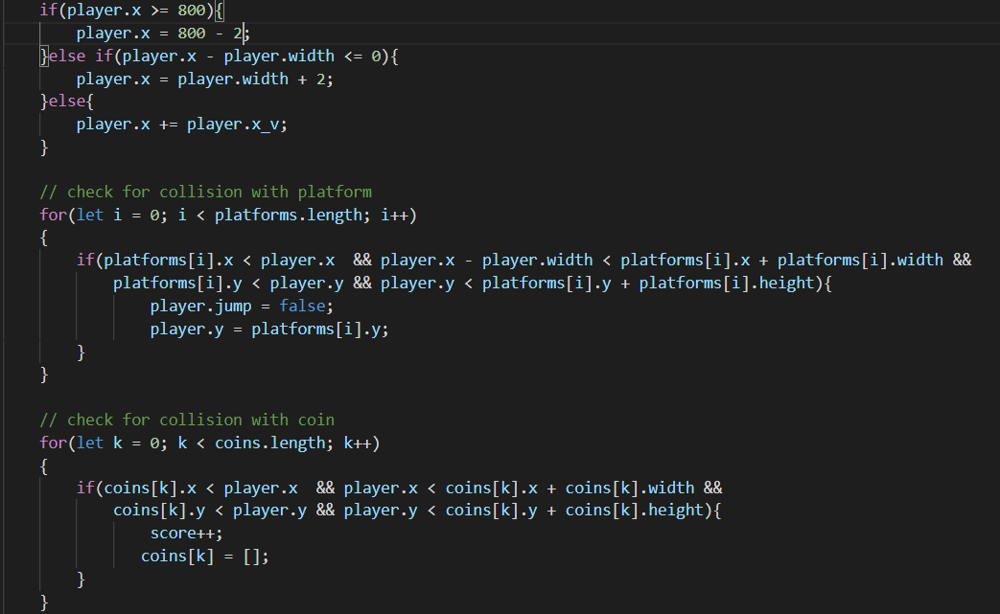
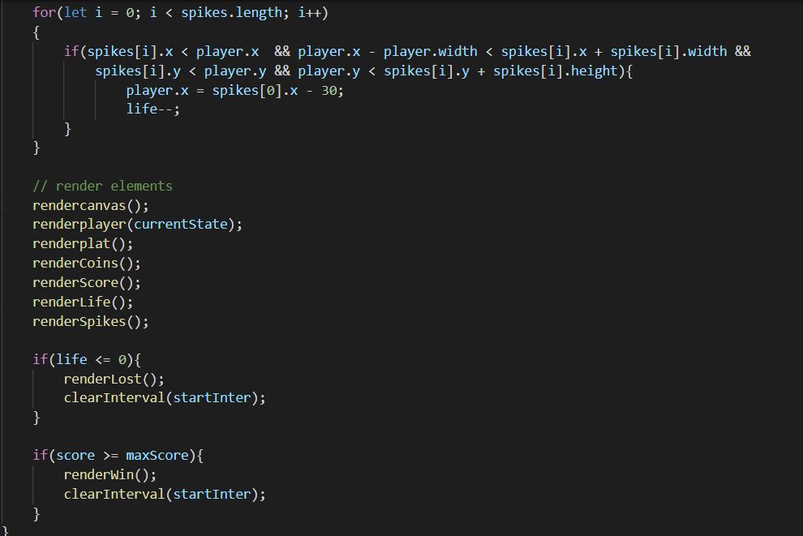
* Funkcja loop() jest główną pętlą odpowiadającą za renderowanie gry oraz obsługę kolizji, przemieszczania się użytkownika.
* Przemieszczanie się użytkownika jest obsługiwane za pomocą wartości 'x_v' która dodawana jest do obecnego położenie gracza.
* Skok użytkownika analogicznie obsługiwany jest za pomocą wartości 'y_v' do której odpowiednio dodawana jest wartość gravity lub mnożona jest przez wartość friction.
* Na 'sztywno' ustawione zostały granice 'canvas' poza które gracz nie może wyjść spełnia to warunek if oraz else który w każdej iteracji pętli sprawdza czy pozycja gracza nie przekracza granic 'canvas'
* Stworzone zostały trzy podobne do siebie pętle odpowiadające za detekcję kolizji z:
** platformami - która ustawia pozycję player.y na platform.y w przypadku kolizji gracza z platformą,
** monetami - która w przypadku kolizji gracza z monetą zwiększa wynik 'score' o jeden oraz usuwa monetę z planszy,
** kolcami - która w przypadku kolizji gracza z monetą zmniejsza życie 'life' o jeden oraz zmienia pozycję gracza (player.x) na pozycję przed pierwszym kolcem.
* Następnie wywoływane są funkcje rysujące wszystkie elementy gry.
* Na końcu pętli dokonywane jest sprawdzenie dwóch warunków kończących rozgrywkę:
** Jeśli życie = 0: wyświetlany jest ekran przegranej,
** Jeśli wynik = maksymalnemu wynikowi do zdobycia w poziomie, wyświetlany jest ekran zwycięstwa.
7. Animacja postaci.
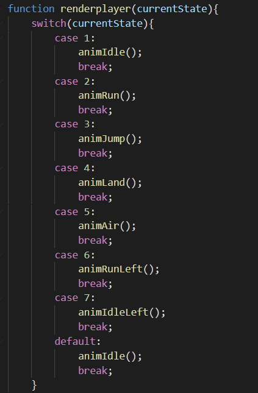
* Animacja postaci dokonywana jest za pomocą 'switch' który sprawdza jaką animację obecnie należy odtworzyć.
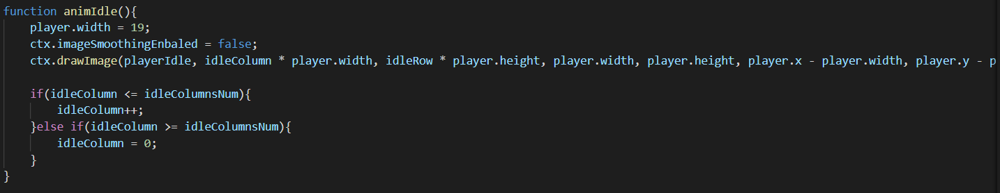
* Powyżej znajduje się przykład funkcji animującej gracza w pozycji spoczynku. 

* Powyżej znajduje się przykład 'sprite sheet' wykorzystywanego do animacji gracza w spoczynku.
8. Sterowanie.
* Ruch w lewo: '<-' lub 'A',
* Ruch w prawo: '->' lub 'D',
* Skok: "strzałka w górę" lub 'W'.
9. Źródła:
* Pixel art wykorzystywany przy animacji gracza, tła gry oraz platform - https://jesse-m.itch.io/jungle-pack ,
* Pixel art wykorzystywany do kolców - https://omniclause.itch.io/spikes ,
* Pixel art wykorzystywany do monet - https://laredgames.itch.io/gems-coins-free .