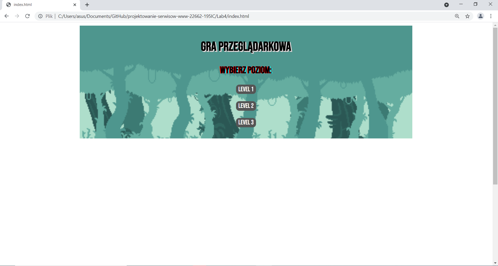
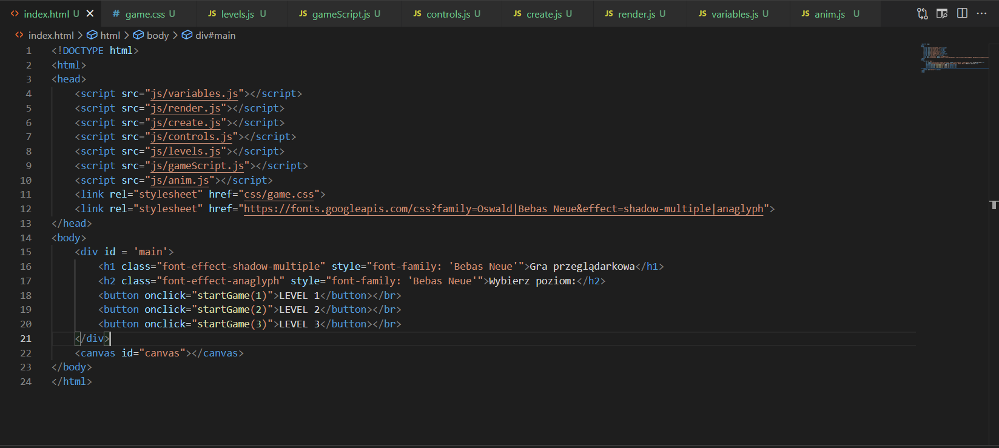

# Laboratorium nr 4 - "Gra przeglądarkowa"
## Wykonałem grę przeglądarkową będącą prostą platformówką, której celem jest zebranie wszystkich monet na planszy unikając przy tym kolcy które odejmują życie.
## Gracz na start otrzymuje 3 życia, po straceniu wszystkich wyświetlany jest ekran przegranej. Po zebraniu wszystkich monet wyświetlany jest ekran zwycięstwa.

1. index.html
* Po uruchomieniu strony pojawia się 'Menu' gry z 3 możliwymi poziomami do wyboru.

* Menu zawarte jest w "div" którego ".display" zmieniany jest na "none" po wybraniu poziomu.

* Następnie wyświetlania jest ilość słów w podanym zdaniu, 
* W zadaniu nr 2 generowane jest ID składające się z losowych znaków,
* W zadaniu nr 3 generowany jest ciąg liczb kończący sie na liczbie podanej przez użytkownika,
* W zadaniu nr 4 sprawdzane jest czy podane przez użytkownika słowo jest palindromem,
* W zadaniu nr 5 wyświetlana jest pierwsza litera imienia podanego przez użytkownika oraz jego imię z wielkiej litery.

* W zadaniu nr 6 w zależności od podanego przez użytkownika miesiąca wyświetla się inny komunikat powiązany z porą roku,
* W zadaniu nr 7 wyświetlana jest liczba kobiet z tablicy podanej w treści zadania,
* W zadnaiu nr 8 wyświetlana jest nazwa miesiąca podanego za pomocą liczby przez użytkownika.

2. eventListener.html

* W pierwszym przykładzie wyświetlany jest tekst z odpowiednią nazwą klawisza wciśniętego przez użytkownika na stronie,
* W drugim przykładzie kolor tła strony zmienia sie na czerwony w momencie podwójnego przyciśnięcia lewego przycisku myszy przez użytkownika na stronie,
* W trzecim przykładzie tekst zawarty w polu zmienia kolor na biały w momencie najechania na pole za pomocą myszy,
* W czwartym przykładzie pole zmienia kolor na czerwony w momencie przytrzymania lewego przycisku myszy a w przypadku puszczenia przycisku zmienia kolor na zielony,
* W piątym przykładzie wyświetlana jest informacja dotyczącą aktualnych rozmiarów okna strony,

* w szóstym przykładzie po skopiowaniu tekstu wyświetla się "alert" informujący o skopiowaniu tekstu,
* W siódmym przykładzie po wpisaniu dowolnego tekstu zostaje on zmieniony na wielkie litery,
* W ósmym przykładzie podczas skrolowania pola kolor tła zmienia się na losowy,
* W dziewiątym przykładzie po wycięciu tekstu zmienia on kolor na czerwony,
* W dziesiątym przykłądzie po naciśnięciu lewym przyciskiem myszy na pole wyświetlany jest tekst.
