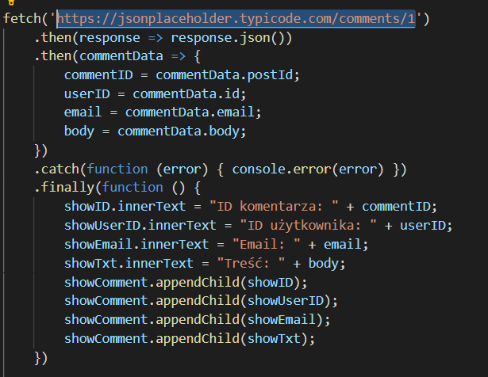
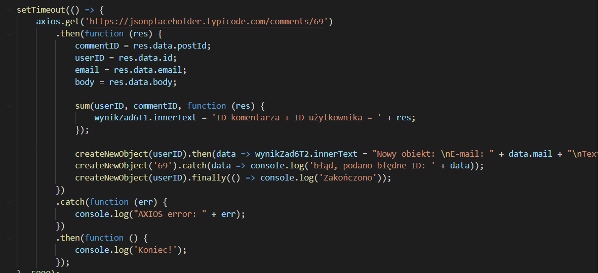

# Laboratorium nr 5 - ""Asynchroniczny Javascript""
0. Obiekt JSON zawierający informacje o graczach.

1. Funkcja zwrotna (callback):
### TASK 1:
* W pierwszym punkcie tworzona jest lista rozwijana zawierająca pobrane nazwy użytkownika z obiektu JSON:
    - funkcja zwracająca tablicę indeksów wszystkich użytkowników.
    
    - funckja dodająca do istniejącej listy nazwy użytkowników zawartych w obiekcie JSON.
    
    - funkcja wywołująca funkcję dodającą wartości do listy
    
    - efekt działania
    
* Po wybraniu nazwy użytkownika z listy rozwijanej, wyświetlana jest informacja o obecnych punktach doświadczenia wybranego gracza, wymaganych punktach do następnego poziomu oraz ile punktów pozostało do zdobycia.
    - funkcja wyświetlająca wyżej podane informacje:
    
    - funkcja pobierająca obecne punkty doświadczenia:
    
    - funkcja pobierająca wymagane punkty do następnego poziomu:
    
    - funkcja obliczająca różnicę:
    
    - wywołanie funkcji wyświetlającej informacje:
    
    - efekt dzialania:
    
### TASK 2
* Po wybraniu nazwy użytkownika z listy rozwijanej, wyświetlana jest informacja o tym do jakiej gildii należy wybrany gracz:
    - funkcja wywołująca funkcję wyświetlającą informacje: 
    
    - funkcja wyświetlająca informacje:
    
    - efekt działania:
    

2. Obiekt Promise.
### TASK 1
* Pobierane są 4 dane z "https://jsonplaceholder.typicode.com/comments/1", które następnie są wyświetlane, a dwie pierwsze pobrane wartości liczbowe są do siebie dodawane a wynik jest wyświetlany.
    - pobranie danych z obiektu JSON:
    
    - funkcja sumująca dwie wartości:
    
    - wywołanie powyższej funkcji z czasem oczekiwania na pobranie wartości = 0.5s.
    
    - efekt działania:
    
### TASK 2
* Wyświetlenie utworzonego, nowego obiektu z pobranych dwóch wartości.
    - funkcja zwracająca nowy obiekt:
    
    - funkcja tworząca nowy obiekt:
    
    - wywołanie utworzenia nowego obiektu (wraz z '.catch' w przypadku błędnej wartości oraz '.finally' w momencie zakończenia). Oczekiwanie na pobranie danych = 1s.
    
    - efekt działania:
    
    
3. Async/await + fetch (lub axios):
### TASK 1
* Wyświetlenie sumy dwóch pierwszych pobranych wartości liczbowych.
    - funkcja 'async' pobierająca dane z "https://jsonplaceholder.typicode.com/comments/2":
    
    - dalsza część funkcji wyświetlająca sumę dwóch pierwszych wartości:
    
    - efekt działania:
    
### TASK 2
* Wyświetalnie nowo utworzonego obiektu.
    - dalsza część funkcji tworząca nowy obiekt:
    
    - wywołanie powyższej funkcji z czasem oczekiwania 4s na pobranie danych.
    
    - efekt działania:
    
    
4. Zapytania AJAX:
* Funkcja AJAX pobierająca dane oraz wyświetlająca sumę dwóch pierwszych wartości jak i wyświetlający nowy obiekt.
    
* Efekt działania:
    
    
5. Metoda fetch:
* Funkcja wykorzystująca 'fetch' pobierająca dane oraz wyświetlająca sumę dwóch pierwszych wartości jak i wyświetlający nowy obiekt.
    
* Efekt działania:
    
    
6. Biblioteka axios:
* Funkcja wykorzystująca 'axios' pobierająca dane oraz wyświetlająca sumę dwóch pierwszych wartości jak i wyświetlający nowy obiekt.
    
* Efekt działania:
    