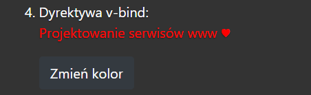
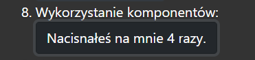
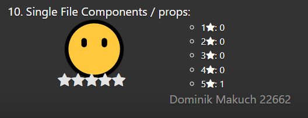

# Laboratorium nr 6 - "Vue - aplikacja nr 1"
Stworzyłem aplikację w Vue.js składającą się z kolejnych punktów wykorzystujące różne elementy Vue.
### 1. Pierwszy oraz drugi punkt jest przykładem wykorzystania dyrektyw v-if oraz v-on do wyświetlania oraz "chowania" tekstu za pomocą przycisku.

Z poziomu kodu same aplikacje są bliźniacze, co je różni to właśnie użycie dwóch różnych dyrektyw:

### 2. Trzeci punkt obrazuje użycie dyrektywy v-for za pomocą której wyświetlane są informacje o wszystkich danych zawartych w liście. 

### 3. Czwarty punkt wykorzystując dyrektywę v-bind zmienia kolor tekstu poprzez zmianę przypisanej do niego klasy. Klasa "red" oraz "blue" ma przypisany CSS w osobnym pliku. 

### 4. Piąty punkt przedstawia działanie dyrektywy v-model dzięki której tekst wpisywany w polu zostaje ustawiony jako tekst paragrafu pod nim.

### 5. Szósty punkt wykorzystuje właściwość "computed" dzięki której tekst jest przekształcany za pomocą określonych funkcji.

### 6. Siódmy punkt przedstawia obsługę zdarzeń za pomocą Vue.js w tym przypadku po naciśnięciu przycisku wyświetla się informacja o wciśnięciu przycisku.

### 7. Ósmy punkt jest prostym przykładem wykorzystania komponentów do stworzenia przycisku liczącego ile razy został wciśnięty plusem komponentów jest możliwość wielokrotnego wykorzystywania bez konieczności powtarzania kodu.

### 8. Dziewiąty punkt przedstawia wykorzystanie biblioteki Vuex do operacji na stanach w tym przypadku stworzyłem prosty licznik umożliwiający zmianę wartości liczbowej w górę lub w dół.

### 9. Ostatni punkt przedstawia wykorzystanie Single File Components w celu stworzenia prostej aplikacji do zostawiania ocen. 

## 1. Aplikacja ta składa się z:
- App.vue: W nim tworzony jest template aplikacji oraz definiowane są wykorzystywane później funkcje. 

- Star.vue: W nim wywoływane są poprzednio wspomniane funkcje i zmieniany jest wygląd gwiazdki w prypadku najechania myszką bądź kliknięcia.

- Summary.vue: W nim definiowane jest wyświetlane poprzednich ocen które zapisywane są w pamięci przeglądarki.

