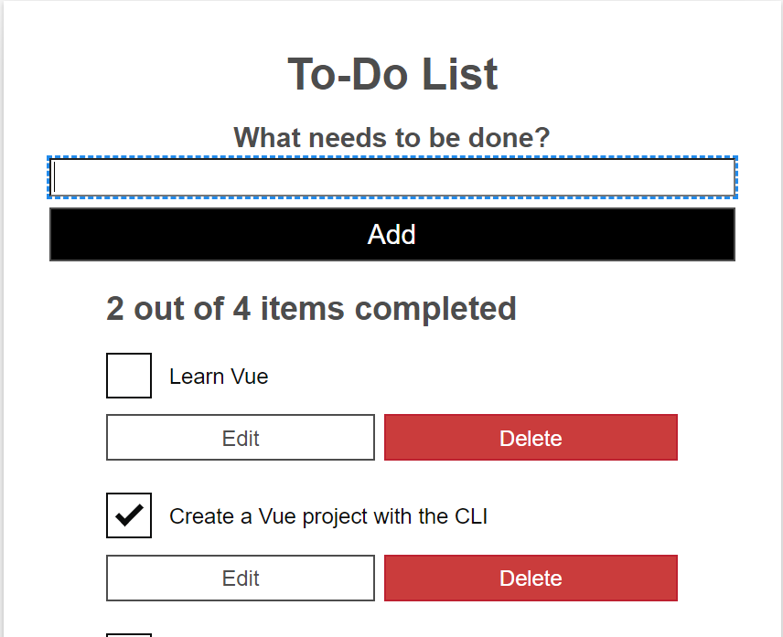

# Laboratorium nr 8 - "Vue - aplikacja nr 3 + analiza kodu źródłowego + git difftool"
Wybrałem aplikację To-do którą edytowałem dodając Vuetify w celu stworzenia bardziej responsywnego widoku aplikacji oraz dodania alertów wyświetlających się w przypadku błednych wartości podanych przez użytkownika.  
Link do bazowej aplikacji: https://mdn.github.io/todo-vue/dist/
### 1. Porównanie wprowadzonych zmian.

* Bazowa aplikacja:

* Zmodyfikowana aplikacja:
 Główne zmiany to dodanie Vuetify w celu zmiany statycznego opisu pola tekstowego na opis zmieniający położenie dynamicznie w momencie rozpoczęcia wpisywania nazwy nowego zadania.
 Kolejnym widocznym elementem jest zmiana przycisku "Add" na przycisk zawarty na końcu pola tekstowego zawierający ikonę "plusa". Zauważyć można również wprowadzoną zmianę dotyczącą wyświetlania dodanych zajęć. Zajęcia wyświetlane są teraz w osobnych kartach z małym checkboxem oraz przyciski "Edit" oraz "Delete" zmienione są na przyciski zawierające ikony pióra oraz kosza umiejscowione w lewym dolnym rogu karty.

 Zakończone zadania również zostały zmodyfikowane, ponieważ teraz jeśli zadanie jest zaznaczone jako ukończone to karta tego zadania zmienia swój kolor na ciemniejszy dzięki czemu łatwiej jest odróżnić zakończone zadania od pozostałych.

* Bazowa aplikacja - edycja zadań:

* Zmodyfikowana aplikacja - edycja zadań:

Edycja zadań również uległa zmianie formularz jest teraz stworzony z wykorzystaniem Vuetify a przyciski "Cancel" oraz "Save" zostały zmienione na ikony przekleśonego okręgu oraz dyskietki. 

Zostały również dodane alerty w przypadku nie podania nazwy nowego zadania oraz w przypadku podania tej samej nazwy zadania w przypadku jej edycji.

### 2. Analiza kodu źródłowego.

* App.vue:

* ToDoForm.vue:

* ToDoItem.vue:

* ToDoItemEditForm.vue:

### 3. Komenda difftool.

* App.vue:

* ToDoForm.vue:

* ToDoItem.vue:

* ToDoItemEditForm.vue:

